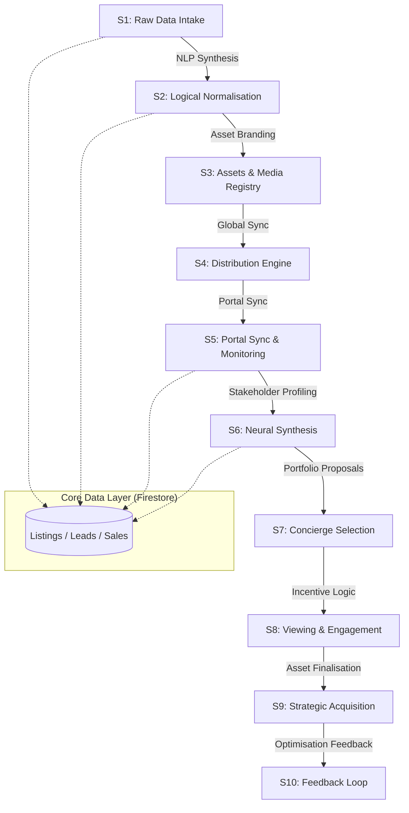

# SIERRA BLUE AI OPERATING SYSTEM — V12.0
## CANONICAL CODEX

This document is the **single source of truth** for the architecture, orchestration, and intelligence layers of the Sierra Blue PropTech platform (Next.js frontend).

---

### 🧠 ARCHITECTURAL VISION
The system is built as a **Unified Operating System (OS)** that transforms fragmented real estate workflows into a continuous 10-stage intelligence pipeline.

---

### 🗄️ DATABASE SCHEMA STRATEGY (FIRESTORE)

All documents inherit from `BaseDocument` and include an `orchestrationState` to track lifecycle movement.

#### 1. Listings (`listings`)
*   **Identity**: `code` (standardized suffix), `compound`, `propertyType`.
*   **Orchestration**: `orchestrationState.stage` tracks S1-S4.
*   **Automation**: `automation` flags for Branding, Publishing (PF/FB), and WhatsApp readiness.
*   **Ownership**: `ownerType` (Owner / Broker / Internal) to ensure data cleanliness.

#### 2. Leads (`leads`)
*   **Profiling**: `aiProfiling` stores interests and `topMatches` (S6 output).
*   **Pipeline**: `stage` (CRMStage) and `automation` status for follow-ups and reminders.

#### 3. Sales & Vouchers (`sales` / `vouchers`)
*   **Transactions**: Tracks `commissionAmount` and `closingDate`.
*   **Incentives**: `vouchers` collection for Stage 7 closures.

#### 4. Broker Intelligence (`broker_listings`)
*   **Source**: Ingests raw messages from WhatsApp/Telegram via `WhatsAppParserService`.
*   **State**: Tracks `parsed` vs `raw` messages for manual verification.

---

### ⚙️ ORCHESTRATION PROTOCOLS

The system uses **Triggers** to move data across the pipeline:

1.  **Ingest → Parse (S1-S2)**: Handled by `WhatsAppParserService.ts` using Gemini 1.5 Flash.
2.  **Parse → Brand (S2-S3)**: Manual or automatic Canvas branding hooks.
3.  **Lead → Match (S5-S6)**: Triggered upon new lead scoring or inventory updates.
4.  **Proposal → Deployed (S7)**: Handled by `ProposalService.ts` to generate AI-curated asset packages for leads.
5.  **Incentive → Close (S7-S9)**: Managed via the `VoucherSystem.tsx`.

---

### 🌍 BILINGUAL INTERFACE (I18n)

All UI elements must support **English (EN)** and **Arabic (AR)** through the following pattern:
- **Keys**: All strings must be extracted to `messages/ar.json` and `messages/en.json`.
- **RTL Support**: Use `textAlign: locale === 'ar' ? 'right' : 'left'` and standard Flex-box behaviors.
- **Data Ar/En**: Schema includes `titleAr`, `descriptionAr`, `nameAr` for bilingual persistence.

---

### 🎨 DESIGN AESTHETIC (LUXURY PROTOCOL)
*   **Core Palette**: Navy (`#0A1A3A`), Gold (`#C9A24A`), Silver (`#E2E8F0`).
*   **Aesthetics**: Glassmorphism, Micro-animations (Framer Motion), Cinematic Surfaces.
*   **Typography**: Serif headers (Playfair Display/Cinzel) for luxury, Sans-serif (Inter/IBM Plex Sans Arabic) for data-density.

---

### 🛠️ TOOLING & INTEGRATIONS (CONTEXT)
*   **Make.com**: Planned for Stage 4 (Distribution) and Stage 8 (Reminders).
*   **Firebase**: Hosting, Auth, and Firestore (Core).
*   **Google Generative AI**: Gemini 1.5 Flash (Parsing) and Gemini 2.5 Flash-Lite (OpenClaw Insights).

---
*Last Synchronized: 2026-04-28*
*Version: 12.0.0 (Base 44 — Quiet Luxury Standard)*

